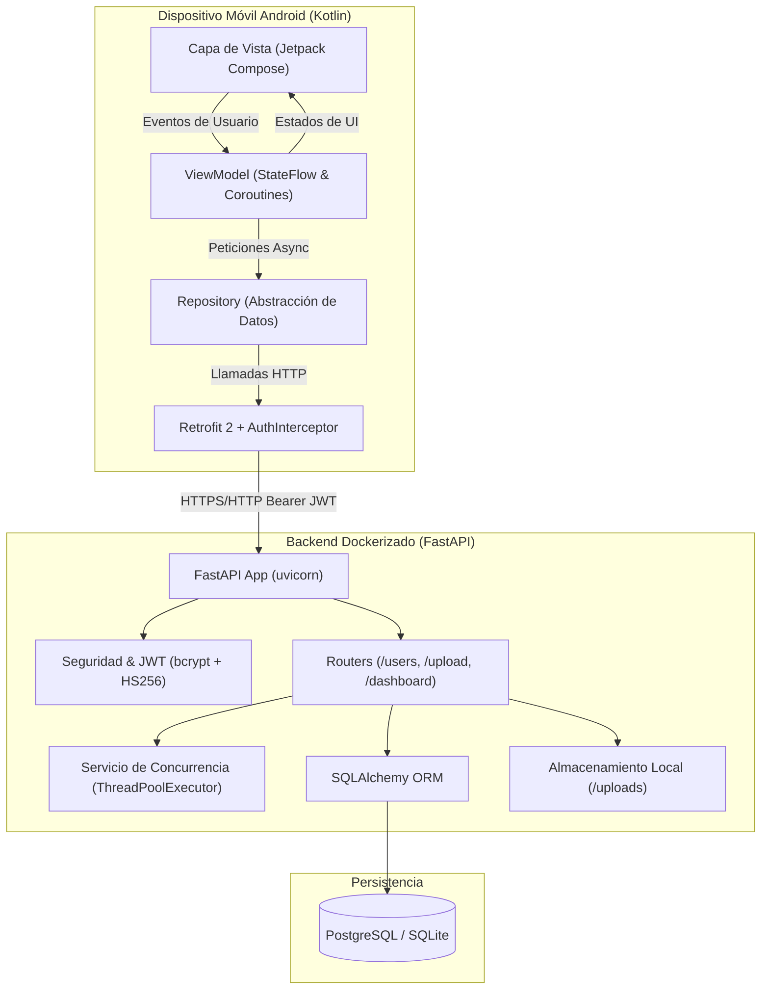

# Arquitectura del Sistema: Paralelo Móvil

Este documento describe la arquitectura global y los componentes del sistema cliente-servidor desarrollado para la asignatura de **Algoritmos Paralelos**.

---

## 1. Visión General del Sistema

El sistema implementa una arquitectura desacoplada basada en servicios REST, donde una **aplicación móvil nativa en Android (Kotlin)** consume un **Backend en FastAPI (Python)** orquestado con **Docker**.



---

## 2. Arquitectura de la Aplicación Móvil (Android Kotlin - MVVM)

La aplicación sigue estrictamente el patrón arquitectónico **Model-View-ViewModel (MVVM)** recomendado oficialmente por Google para Android, garantizando una separación clara de responsabilidades:

```
View  ──→  ViewModel  ──→  Repository  ──→  Services (Retrofit)  ──→  API REST
  ▲             │
  └─────────────┘ (Observación reactiva de StateFlow)
```

### Componentes de la Capa Móvil:

1. **View (Vistas / UI):**
   - Implementadas con **Jetpack Compose** y **Material 3**.
   - Responsabilidades: Renderizar la interfaz gráfica, capturar eventos de interacción (clicks, formularios) y observar reactivamente los cambios de estado expuestos por los ViewModels.
   - Pantallas:
     - `LoginScreen`: Formulario de login, registro y configuración dinámica de IP del servidor.
     - `DashboardScreen`: Muestra métricas del sistema y consumo simultáneo de endpoints.
     - `UsersScreen`: CRUD completo de usuarios con modales interactivos.
     - `BenchmarkScreen`: Demostración visual en vivo de ejecución secuencial vs. concurrente con cronómetros individuales.

2. **ViewModel (Lógica de Presentación):**
   - Responsabilidades: Mantener y gestionar el estado de la UI (`UiState`), manejar estados de carga (`Loading`, `Success`, `Error`), y coordinar la concurrencia en segundo plano mediante `viewModelScope.launch`.
   - Clases:
     - `AuthViewModel`: Control de sesión y login con JWT.
     - `UsersViewModel`: Operaciones CRUD sobre usuarios.
     - `DashboardViewModel`: Orquesta el consumo simultáneo de los 4 endpoints del dashboard.
     - `ConcurrencyBenchmarkViewModel`: Ejecuta la medición y cálculo de aceleración (Speedup) secuencial vs. concurrente.

3. **Repository (Abstracción de Datos):**
   - Responsabilidades: Proveer una fuente de verdad única para los datos, abstrayendo si la información proviene de la red o de la caché local.
   - Clases:
     - `AuthRepository`, `UserRepository`, `FileRepository`, `DashboardRepository`.

4. **Services / Network Layer:**
   - **Retrofit 2:** Cliente HTTP tipo seguro para interactuar con la API.
   - **AuthInterceptor:** Interceptor de OkHttp que lee automáticamente el token JWT almacenado en `SessionManager` y agrega la cabecera `Authorization: Bearer <TOKEN>` a cada petición protegida.

5. **Models / DTOs:**
   - Data classes en Kotlin (`User`, `LoginRequest`, `TokenResponse`, `FileUploadResponse`, `SystemStats`, `TaskItem`, etc.) serializados con `Gson`.

---

## 3. Arquitectura del Backend (FastAPI + Docker)

El backend está estructurado modularmente para maximizar la mantenibilidad y desacoplamiento:

```text
backend/
├── app/
│   ├── core/          # Configuración de variables de entorno y utilidades criptográficas (JWT y bcrypt)
│   ├── database/      # Conexión SQLAlchemy, fábrica de sesiones y Base declarativa
│   ├── models/        # Modelos ORM (User, FileRecord)
│   ├── schemas/       # Esquemas Pydantic para validación y serialización de datos
│   ├── routers/       # Endpoints modularizados (auth, users, files, dashboard)
│   ├── services/      # Lógica computacional y concurrencia (ThreadPoolExecutor)
│   └── main.py        # Inicialización de FastAPI, CORS y middleware
├── uploads/           # Directorio físico donde se almacenan los archivos subidos
├── Dockerfile         # Imagen optimizada de Python 3.11-slim
└── docker-compose.yml # Orquestación de la API junto con la base de datos PostgreSQL
```

---

## 4. Esquema de Base de Datos

La persistencia se modela con dos entidades principales:

### Tabla: `users`
| Campo | Tipo | Restricciones | Descripción |
|---|---|---|---|
| `id` | INTEGER | PRIMARY KEY, AUTOINCREMENT | Identificador único del usuario |
| `nombre` | VARCHAR(100) | NOT NULL | Nombre de pila |
| `apellido` | VARCHAR(100) | NOT NULL | Apellido |
| `email` | VARCHAR(150) | UNIQUE, INDEX, NOT NULL | Correo para inicio de sesión |
| `password` | VARCHAR(255) | NOT NULL | Contraseña con hash seguro `bcrypt` con sal |
| `foto` | VARCHAR(255) | NULLABLE | URL o nombre de foto de perfil |
| `createdAt` | TIMESTAMP | DEFAULT CURRENT_TIMESTAMP | Fecha de creación del registro |

### Tabla: `files`
| Campo | Tipo | Restricciones | Descripción |
|---|---|---|---|
| `id` | INTEGER | PRIMARY KEY, AUTOINCREMENT | Identificador del archivo |
| `filename` | VARCHAR(255) | NOT NULL | Nombre único asignado con prefijo UUID |
| `original_name`| VARCHAR(255) | NOT NULL | Nombre original del archivo |
| `url` | VARCHAR(255) | NOT NULL | URL pública de acceso `/uploads/...` |
| `mime_type` | VARCHAR(100) | NULLABLE | Tipo MIME del contenido |
| `size` | INTEGER | NULLABLE | Tamaño en bytes |
| `createdAt` | TIMESTAMP | DEFAULT CURRENT_TIMESTAMP | Fecha de subida |

---

## 5. Dockerización y Despliegue

La infraestructura se despliega en contenedores mediante `docker-compose.yml`:
1. **Contenedor `api` (FastAPI):**
   - Construido desde `Dockerfile` basado en `python:3.11-slim`.
   - Expone el puerto `8000:8000`.
   - Monta un volumen persistente para `./uploads` evitando la pérdida de archivos al reiniciar.
   - Configura reinicio automático y espera la salud de la base de datos (`depends_on: condition: service_healthy`).
2. **Contenedor `db` (PostgreSQL 16 Alpine):**
   - Base de datos relacional ligera con volumen nombrado `postgres_data`.
   - Healthcheck activo mediante comando `pg_isready`.
